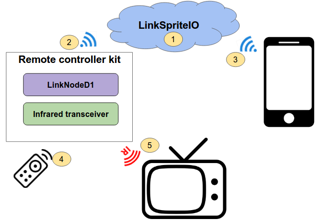
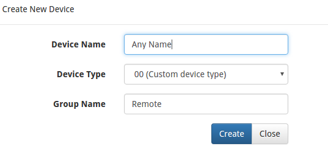
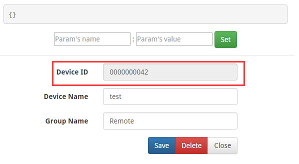
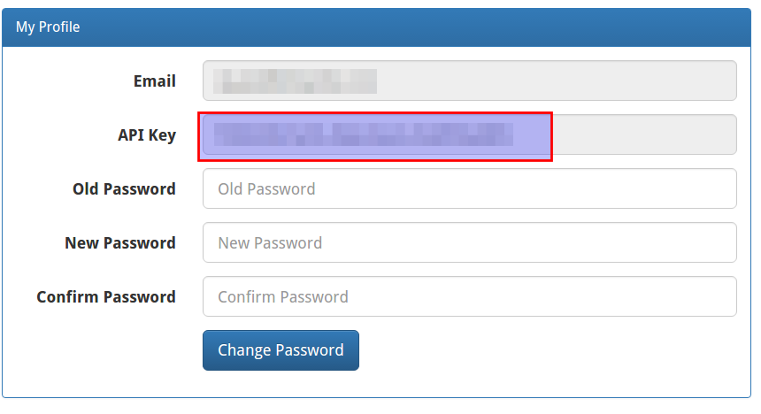
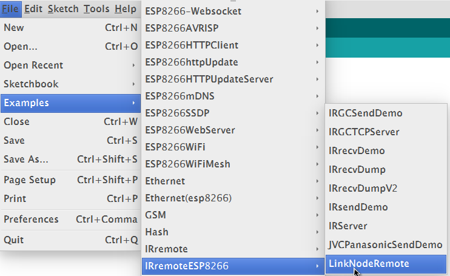
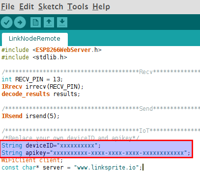
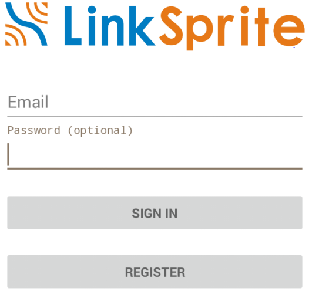
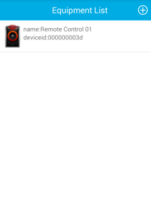
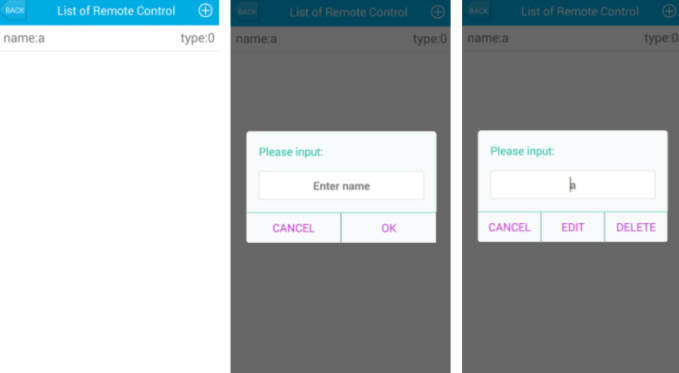
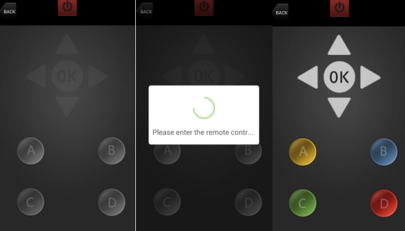

# Remote controller kit
Recently, we have developed an open source remote controller which includes LinkNode D1 and Infrared shield. Users can take this remote controller and android APP to control home appliances like TV, air conditioner which can replace the IR controller.

## Features
- [LinkNode D1](http://www.linksprite.com/wiki/index.php5?title=LinkNode_D1)
- [Infrared Shield](http://www.linksprite.com/wiki/index.php5?title=Infrared_Shield_for_Arduino)
- Connecting to LinkSpriteIO IoT cloud server
- Learning Infrared encoding

## Tutorial
### 1. Prerequisites

**Hardware**
* LinkNode D1 x 1
* Infrared Shield x 1  
* One home appliance supporting IR remote control

**Software**
* Arduino IDE 1.6.8 with ESP8266 Arduino core

### 2. Basic working flow
1. Login **linksprite.io** and create a remote device on the platform
2. Makers program the reference Arduino project to LinkNode D1 and let it connect to LinkSpriteIO 
3. APP will connect to LlinkSpriteIO and list the Remote device
4. Learn the infrared encoding from your IR remote controller
5. Use APP to control your home appliance

### 3. Details

#### a. Login [LinkSprite.io](www.linksprite.com)
- Go to **My devices --> Create DIY device**
- Create new device:
	* Device Name: any name
	* Device Type: **00(Custom Device type)**
	* Group Name : **Remote**

  

- Open the new created Device and get DeviceID

 

- Go to My profile to get your own API key.

  
 
### b. Download the source code from github
- Download the source code from github and put the **IRremoteESP8266-master** folder to your (Arduino IDE PATH)/libraries directory
- Open Arduino IDE and make sure you have installed the ESP8266 hardware packages, details you can check [here](http://www.linksprite.com/wiki/index.php5?title=LinkNode_D1)
- Go to File->Examples->IRremoteESP8266-->LinkNodeRemote and open it

- Update your own apikey and deviceID

- Program this project to LinkNode D1.

### c. Download and install Android APP
- Download the Android APP file from [github](https://github.com/YaoQ/LinkNodeRemote)
- Use your account to sign in linksprite.io

    

- After that APP will list the device group which we create before

   

- Click this device group, and add remote device

- Choose a button on the APP, press it and hold on
- At the same time, press corresponding button on your IR remote controller
- The LinkNode D1 will record this button's infrared encoding, then send a signal to tell APP, it has already get this button's infrared encoding!
- APP will highlight this button. If you want to learn more button, repeat the steps above
- After all, you can click button on APP to send command to LinkNode D1 via linkspriteIO
- LinkNode D1 will resend the infrared signal which is recorded before

  

Using this open source Remote controller and APP, the IR controller of home appliance should be completely replaced.

Enjoy it!

## Ref
1. [Install ESP8266 hardware core for Arduino IDE ](http://www.linksprite.com/wiki/index.php5?title=LinkNode_D1)
